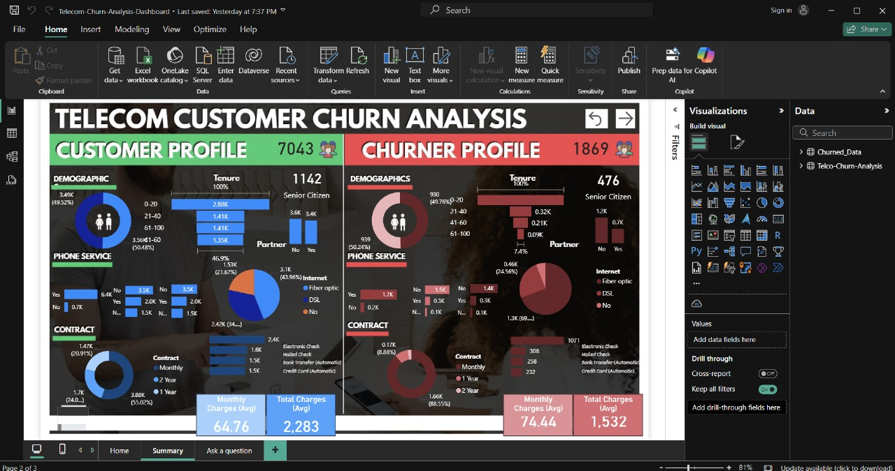

# 📉 Customer Churn Analysis (Telecom) – Power BI Project

> 🔍 **To explore the analysis, open the .pbix file in Power BI Desktop and the .xlsx or .csv data file in Excel.**

---

## 🗂 Repository Overview

This repository contains an end-to-end *Customer Churn Analysis* project for a telecom company. The project compares churned vs active customers and identifies patterns in behavior, demographics, and billing preferences using interactive Power BI dashboards.

---

## 📌 Project Description

The dashboard answers key business questions like:
- What are the key demographics of churners?
- Do certain services, contract types, or payment methods increase churn?
- How do active customers differ from churned ones in usage or billing?

### Key Highlights:
- Built comparative dashboards for *Churner* and *Customer* profiles
- Highlighted churn-prone categories and behaviors
- Designed visual storytelling to support strategic retention efforts

---

## 🧰 Tools & Technologies Used

- *Power BI* – For interactive dashboards  
- *Excel* – For preprocessing and organizing raw data  
- *DAX* – For calculated columns and KPIs  
- *Descriptive Statistics* – For trend discovery and segmentation  

---

## 📊 Dashboard Snapshot

> Dashboard compares churned vs retained customers by age group, tenure, phone service, contract type, internet service, payment methods, and more.



---

## 🚀 How to Use This Repository

To get started:

1. *Clone or Download the repository*:
   ```bash
   git clone https://github.com/your-username/Customer-Churn-Analysis.git

